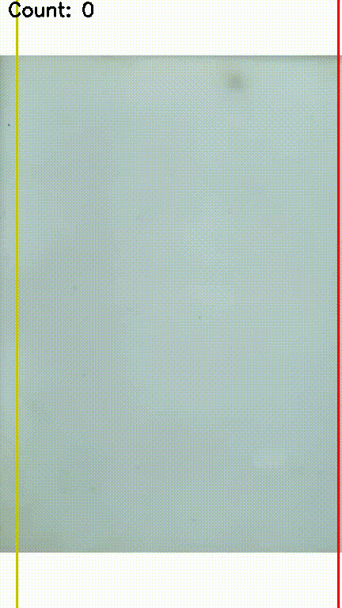

# Fish Tracking 

Dự án này nhằm tự động phát hiện, theo dõi và đếm số lượng cá di chuyển qua camera. Hệ thống được tối ưu hóa trên CPU bằng OpenVINO và sử dụng thuật toán Tracking tùy chỉnh giúp đếm chính xác, chống trùng lặp.

---

##  Cấu trúc dự án (File Tree)


```text
yolo_fish/
├── dataset/     
├── fishing/                  # Thư mục chứa các video đầu vào 
├── infer480.py               # Script detect 
├── tracking.py               # Script tracking + detect
├── 480.pt                    # weights mô hình YOLO đã huấn luyện
├── README.md                 # 
└── ...                       # Các video kết quả xuất ra (.mp4)
```

---

##  Tổng quan Thuật toán

Dự án xây dựng một luồng xử lý tùy chỉnh gồm 3 thành phần cốt lõi để giải quyết trọn vẹn bài toán đếm:

### 1. Nhận diện đối tượng (YOLO & OpenVINO)
Hệ thống sử dụng thư viện `ultralytics` kết hợp với file mô hình `480.pt` để dò tìm Bounding Box trong từng khung hình.
*   **Tối ưu hóa CPU**: Điểm đặc biệt là code được thiết lập tự động chuyển đổi mô hình Pytorch (`.pt`) sang định dạng **OpenVINO (INT8 Quantization)**.

### 2. Theo dõi đối tượng (Object Tracking)
*   **Kalman Filter (Dự đoán)**: Mỗi object được cấp một bộ lọc Kalman để quản lý trạng thái tọa độ và vận tốc. Dựa trên dữ liệu các frame trước, Kalman sẽ tính toán và đoán xem ở frame tiếp theo con cá sẽ bơi tới đâu.
*   **Hungarian Algorithm (Ghép cặp)**: Sử dụng hàm `linear_sum_assignment` của thư viện `scipy`. Thuật toán này dùng ma trận khoảng cách để ghép nối tọa độ thực tế (vừa quét được) với tọa độ dự đoán (của Kalman) sao cho tổng sai số là nhỏ nhất. Nhờ vậy, ID của cá được giữ nguyên mà không bị nhảy loạn xạ.

### 3. Rule-based Counting & Filtering
*   **Direction Rule**: Bắt buộc đối tượng chỉ di chuyển từ trái sang phải. Bỏ qua các ghép cặp (matching) đi lùi.
*   **Noise Filter**: Chỉ theo dõi các đối tượng có kích thước hợp lý (nhỏ hơn `MAX_AREA`) và tồn tại đủ lâu (đạt `MIN_TRACK_AGE`).
*   **Exit Line**: Đếm thành công và giải phóng ID khi bounding box của đối tượng chạm vạch đích ảo bên phải màn hình.
*   **Lost Recovery**: Nếu đối tượng đột ngột mất dấu (do bơi quá nhanh hoặc bị che khuất) nhưng đã đủ tuổi thọ, hệ thống mặc định coi là cá đã bơi qua và tự động đếm bù.
*   **Duplicate Prevention**: Tọa độ cá vừa rời đi sẽ được lưu vào danh sách đen tạm thời. Bỏ qua mọi nhận diện mới xuất hiện tại vùng này để chống đếm đúp (nhận diện nhầm đuôi cá).

---

## Cài đặt & Sử dụng

**1. Cài đặt môi trường:**
Đảm bảo máy tính đã cài đặt Python 3.8+. Mở Terminal tại thư mục dự án và cài đặt các phụ thuộc:
```bash
pip install ultralytics opencv-python numpy scipy openvino
```

**2. Hướng dẫn chạy:**
Bạn có thể mở file `tracking.py` để trỏ `VIDEO_IN` tới video bạn muốn chạy thử. Sau đó gõ lệnh:
```bash
python tracking.py
```
*Ghi chú: Trong lúc chạy, nhấn phím `q` để thoát hiển thị. Kết quả cuối cùng (Video có vẽ hộp thoại và bộ đếm) sẽ được tự động xuất ra file (ví dụ: `track_480.mp4`).*

---

## Demo

